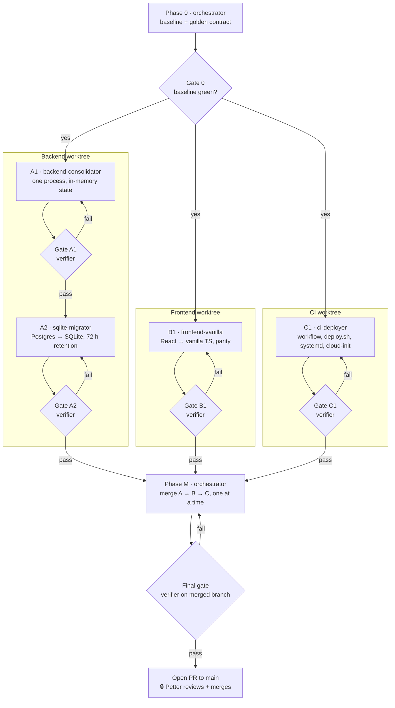

# Cloud migration: implementation plan (multi-agent)

**Audience:** Claude Code, running as the *orchestrator* in the repo root, with the
subagents defined in `.claude/agents/`. Start it with `/cloud-migration`
(see `.claude/commands/cloud-migration.md`).

**Owner:** Petter. Anything marked **🔒 ASK** needs his answer before proceeding.

---

## 1. Goal

Move flight-tracker from "four containers on a NAS" to "one JVM process on a
Hetzner VM", deployed automatically from `main`:

| Today | Target |
|---|---|
| 3 Spring profiles (`api`, `agent`, `estimator`) in 3 containers | 1 process, no profiles |
| Postgres 16 container | SQLite file (WAL mode) at `$FLIGHTTRACKER_DB_PATH` |
| `LISTEN`/`NOTIFY` between api and agent | In-process Spring events |
| `aircraft_latest_position`, `poll_window`, `viewport_state` tables | In-memory state (`LiveStateStore`, `PollWindowService`, `ViewportService`); only budget counters persisted |
| Estimator writes estimates to Postgres every 30 s | Estimator writes into `LiveStateStore` (no DB writes) |
| React 18 + react-leaflet | Vanilla TypeScript + Leaflet (MapLibre basemap kept) |
| nginx container serves SPA, proxies `/api` `/ws` | JVM serves the built SPA from the jar; same origin |
| 24 h retention | 72 h retention (configurable) |
| GHCR images, manual `docker compose pull` on the NAS | GitHub Actions builds a jar and deploys it to Hetzner over SSH through Cloudflare Access (service token) on every green `main` |

**Non-goals:** changing the public HTTP/WS API, adding features, replacing
Spring Boot (possible later, see §9), moving off Leaflet.

## 2. Frozen contracts (the thing that makes parallel work safe)

These do **not** change during the migration. Every agent treats them as
read-only. A change to any of them is a 🔒 ASK.

1. **HTTP API**: every route in `controller/*` (`/api/flights/*`,
   `/api/aircraft/{icao24}`, `/api/airports/info`, `/api/usage`,
   `/api/agents/{status,restart,stop}`), same paths, params, status codes and
   JSON field names/types. Additive only: new `GET /api/health`.
2. **WebSocket**: `GET /ws/live`, same frame shape (`FlightPosition` JSON).
   Additive only: server ping frames for keepalive.
3. **Frontend API client**: `frontend/src/api/flightApi.ts`,
   `frontend/src/types/flight.ts` keep their exported signatures.
4. **DOM contract**: element ids, class names, `data-testid`s and ARIA
   attributes the Playwright specs in `frontend/tests/` select on.
5. **Test suites as acceptance criteria**: `blackbox-tests/` (must pass against
   the new jar unchanged) and `frontend/tests/` (must pass; only edits allowed
   are removing React-specific internals a spec reaches into, each listed in
   the PR description).

Phase 0 captures the contract as golden files so drift is detectable.

## 3. Agent roster

| Agent (`.claude/agents/`) | Owns (may edit) | Must not edit | Worktree / branch |
|---|---|---|---|
| **orchestrator** (main session) | `docs/cloud-migration/**`, merges, `CLAUDE.md` | application code directly | repo root, `feat/cloud-migration` |
| `backend-consolidator` | `backend/src/main/java/**`, `backend/src/main/resources/application*.yml`, `backend/src/test/**` | `pom.xml` `<build>`, frontend, workflows | `wt/backend` → `feat/cm-backend` |
| `sqlite-migrator` | `backend/src/main/java/**/repository/**`, `model/**`, persistence services, `schema*.sql`, `pom.xml` `<dependencies>` | frontend, workflows | same worktree as backend-consolidator, **after** it (sequential) |
| `frontend-vanilla` | `frontend/**` except `frontend/tests/**` (see contract 5) | backend, workflows | `wt/frontend` → `feat/cm-frontend` |
| `ci-deployer` | `.github/workflows/**`, `deploy/hetzner/**`, `pom.xml` `<build>` / `<profiles>` only | application code | `wt/ci` → `feat/cm-ci` |
| `verifier` | nothing (read + run only); writes reports to `docs/cloud-migration/reports/` | everything else | fresh checkout of the branch under review |

Rules for every agent:

- Work only inside owned paths. If a change outside is needed, stop and report
  it to the orchestrator instead of making it.
- Commit small, conventional commits (`feat(backend): …`). Never push to `main`.
- Finish with a hand-off report (template in §8), never with "done".

## 4. Phases and gates



Streams A, B and C run **in parallel** (each spawned with
`isolation: "worktree"`). A1 → A2 is sequential in the same worktree because
both rewrite the persistence layer.

A gate = spawn `verifier` with the branch name and the gate's checklist
(§7). On FAIL, send the verifier's report back to the same agent
(`SendMessage`) with "fix these, then report again". Max 3 loops per gate,
then stop and 🔒 ASK.

---

## 5. Phase 0: baseline (orchestrator)

1. `git checkout -b feat/cloud-migration` from `main`.
2. Run and record (to `docs/cloud-migration/reports/00-baseline.md`):
   - `cd backend && mvn -B verify`
   - `cd frontend && npm ci && npm run build && npx playwright install chromium && npm run test:e2e`
   - `docker compose up -d --build --wait`, then
     `BASE_URL=http://localhost:5173 node --test 'blackbox-tests/**/*.test.js'`
   - JS bundle sizes: `ls -l frontend/dist/assets` and gzip sizes.
   - `docker stats --no-stream` memory of each container after 5 minutes.
3. **Golden contract**: with the stack up, save responses to
   `docs/cloud-migration/golden/`:
   `live.json` (`/api/flights/live`), `live-bbox.json`, `clusters.json`
   (`/api/flights/live/clusters?...&gridDeg=2`), `count.json`,
   `status.json` (`/api/agents/status`), `airport-info.json`
   (`/api/airports/info?code=ESSA`), one `aircraft-<icao24>.json`, one
   `history-<icao24>.json`, one `usage.json`. Then write
   `docs/cloud-migration/golden/SHAPES.md`: for each, the JSON field names and
   types (values vary, shapes must not).
4. If anything in step 2 fails on untouched `main`: stop, 🔒 ASK.
5. `docker compose down -v`.

## 6. Work packages

The full briefs live in each agent file. Summary of what each must deliver:

### A1 · backend-consolidator: one process, in-memory state

1. Remove every `@Profile("api" | "agent" | "estimator")`; delete
   `application-agent.yml` and `application-estimator.yml`. The web server
   is always on. Bind to `server.address: ${SERVER_ADDRESS:127.0.0.1}`.
2. Scheduler pool: size = number of `@Scheduled` methods + 1 (currently hot
   poll, global sweep, retention, estimator refresh, airport seed → 6). Keep the
   existing comment's reasoning about why a single thread stalls the hot poll.
3. **Replace `LISTEN`/`NOTIFY`**: delete `PositionNotificationListener`.
   `PositionPersistenceService` publishes `PositionsPersistedEvent(List<FlightPosition>)`;
   `LiveFeedBroadcaster` consumes it with
   `@TransactionalEventListener(phase = AFTER_COMMIT)` (fallback
   `@EventListener` if the publish isn't transactional). Same frames as today.
4. **`LiveStateStore`** (new, `service/live/`): `ConcurrentHashMap<String, LiveAircraft>`
   replacing `aircraft_latest_position`. Port the upsert semantics exactly from
   `FlightPositionRepository.upsertLatestPosition` and the batched equivalent in
   `PositionPersistenceService`: monotonic `observed_at` guard, `landed_since`
   streak logic, clearing `estimated_*` on every real report. Bbox, clustered,
   count, search-by-callsign and per-aircraft reads become in-memory scans
   (~15k entries; linear scan is fine, add a comment saying so).
   **Warm-up on startup:** rebuild from `flight_position` rows newer than the
   longest window in `LiveVisibilityWindows` (latest row per `icao24`).
5. **Estimator**: `EstimatorAgent` reads from and writes estimates into
   `LiveStateStore`. No DB writes. Keep its skip-if-unchanged logic.
6. **Poll window / viewport / quotas**: `PollWindowService` and
   `ViewportService` hold state in memory (single instance now). The **daily
   hot-poll call budget** and **per-IP hot-poll seconds** must survive a restart
   (the original design requirement), so persist those counters in a small
   `app_state(key TEXT PRIMARY KEY, value TEXT, updated_at)` table, written
   through on change. Keep all limits and config keys as they are.
7. **Client IP behind Cloudflare Tunnel (security fix)**: all traffic now
   arrives from `cloudflared` on `127.0.0.1`, so today's fallback to
   `getRemoteAddr()` + `isLocal()` would exempt *every* visitor from rate
   limits. Change `ClientIpResolver.resolve` to prefer `CF-Connecting-IP`,
   then `X-Real-IP`, then `X-Forwarded-For`, then remote addr; and add
   `flighttracker.rate-limit.trust-local: ${TRUST_LOCAL:false}` so the local
   exemption is **off in production** and on only in dev. Unit test both.
8. **OpenSky auth for polling**: if `OPENSKY_CLIENT_ID/SECRET` are set, send
   the bearer token from `OpenSkyOAuthTokenProvider` on `states/all` calls
   too (today it's only used for enrichment). Anonymous stays the fallback.
9. **WebSocket keepalive**: Cloudflare closes WebSockets idle for ~100 s.
   Send a ping (or a tiny `{"type":"ping"}` text frame if the client can't see
   pings; check `subscribeLiveFeed` in `flightApi.ts` and coordinate via the
   hand-off report, don't edit the frontend) every 30 s.
10. **Static SPA**: serve `classpath:/static/**`; any GET that isn't `/api/**`,
    `/ws/**` or a real file returns `index.html`. Long cache headers on
    `/assets/**`, `no-cache` on `index.html`.
11. **Health**: `GET /api/health` → 200 `{"status":"UP","version":"<git sha>","db":"UP","lastSweepAt":…}`
    when the app and DB answer. `version` comes from Spring Boot `BuildProperties`
    (`build-info` goal, additional property `git.sha` passed by CI as
    `-Dgit.sha=…`; fall back to `"dev"`). **`deploy.sh` waits for exactly this
    value**, so it must be the full 40-char SHA. The endpoint does **not**
    depend on OpenSky: deploys must not fail because OpenSky is down. `GET /api/health/sweep` → 200 if the last
    successful global sweep is younger than 3 × interval, else 503 (for
    monitoring only).
12. Update tests that referenced profiles; add unit tests for
    `LiveStateStore` upsert semantics (monotonic guard, landed streak, estimate
    clearing).

At the end of A1 the app still runs on **Postgres** (one process). That's
deliberate: it isolates "did consolidation break behaviour?" from "did SQLite
break behaviour?".

### A2 · sqlite-migrator: Postgres → SQLite

1. **Dependencies**: remove `org.postgresql:postgresql` and
   `spring-boot-starter-data-jpa`; add `org.xerial:sqlite-jdbc` and
   `spring-boot-starter-jdbc`. Replace JPA entities/repositories with
   `JdbcClient` + Java records (the repositories are already mostly native SQL).
2. **`schema.sql` rewrite** for SQLite:
   - timestamps as `INTEGER` epoch **milliseconds** UTC; `BIGSERIAL` →
     `INTEGER PRIMARY KEY`; `DOUBLE PRECISION` → `REAL`; `BOOLEAN` → `INTEGER`.
   - tables: `aircraft`, `flight_position`, `airport`, `app_state`. **Drop**
     `aircraft_latest_position`, `poll_window`, `viewport_state` (in memory
     since A1).
   - keep indexes `uq_position_icao_time_source`, `idx_position_observed_at`,
     `idx_position_icao_ground_time`, the partial `idx_position_recent`.
   - drop the advisory lock (single process now) and the Postgres-specific
     autovacuum settings. Keep the reasoning comments that still apply.
3. **Connection setup** (a `DataSource` bean, Hikari `maximumPoolSize: 4`):
   `PRAGMA journal_mode=WAL; synchronous=NORMAL; busy_timeout=5000;
   temp_store=MEMORY; cache_size=-65536; mmap_size=268435456; foreign_keys=OFF`.
   At DB creation only: `PRAGMA auto_vacuum=INCREMENTAL` (must precede first
   table). DB path from `FLIGHTTRACKER_DB_PATH`, default `./data/flighttracker.db`;
   create parent dir.
4. **SQL translation**: `ON CONFLICT … DO NOTHING/UPDATE` works as is in SQLite;
   `now()` → bound parameter from Java `Clock`; `interval`/timestamp arithmetic →
   compute cutoffs in Java; `DISTINCT ON` → window function or in-memory;
   `TIMESTAMPTZ` mapping via a single `Instant ↔ long` helper.
   Inject a `Clock` bean everywhere `Instant.now()` is used in persistence code
   (tests become deterministic).
5. **Batching**: global sweep insert (~13k rows) in one transaction with
   `executeBatch` of 1 000; verify it completes in < 2 s on the runner and log
   the duration.
6. **Retention** (`PositionRetentionService`): `flighttracker.retention.hours: 72`.
   Batched delete: `DELETE FROM flight_position WHERE id IN (SELECT id FROM
   flight_position WHERE observed_at < ? LIMIT ?)` (no `DELETE … LIMIT`, it's a
   compile flag). After a run: `PRAGMA incremental_vacuum(2000)` and
   `PRAGMA wal_checkpoint(TRUNCATE)`. Nightly: `PRAGMA optimize`. Also delete
   `aircraft` rows not seen for 7 days with no remaining positions.
   Update the comment explaining 24 h → 72 h (the predicting agent needs
   several days of trajectories).
7. **Write reduction** (behind `flighttracker.persistence.skip-unchanged-ground: true`):
   skip inserting an `on_ground` report whose lat/lon/heading equal the
   aircraft's last stored report. Airborne reports always insert. Confirm
   `UsageService` output is unchanged on the golden data.
8. **Tests**: integration tests against a temp-file SQLite (no Testcontainers):
   insert → live read → retention → vacuum; the retention test uses a fixed
   `Clock`.
9. `docker-compose.yml` (root) and `deploy/docker-compose.yml` are now
   obsolete. **Don't delete yet**: list them in the hand-off; the orchestrator
   removes them in Phase M.

### B1 · frontend-vanilla: React → vanilla TypeScript

1. Remove `react`, `react-dom`, `react-leaflet`, `@types/react*`,
   `@vitejs/plugin-react`. Keep `leaflet`, `maplibre-gl`,
   `@maplibre/maplibre-gl-leaflet`, Vite, TypeScript, Playwright.
2. **Keep unchanged** (framework-agnostic already): `api/flightApi.ts`,
   `types/flight.ts`, `favorites.ts`, `theme.ts`, `graticule.ts`,
   `worldMapData.ts`, `cyberpunkMapStyle.ts`, `api/mockFleet.ts`, every `.css`.
3. **Structure**:
   ```
   src/main.ts              boot, wiring
   src/state/store.ts       ~50-line typed observable store (get/set/subscribe)
   src/map/map.ts           L.Map creation, basemap (lazy MaplibreBasemap), viewport reporting
   src/map/markers.ts       aircraft markers, icon cache, selection, follow-selected
   src/map/clusters.ts      cluster rendering + client clustering (port as is)
   src/map/route.ts         history polyline + smoothRoute
   src/ui/<component>.ts    one module per current component: bootScreen, dock,
                            flightSearch, favoritesPanel, legend, themeToggle,
                            scaleBar, defaultAirports, dossierPanel, resumeDialog
   ```
   Each UI module exports `mount(root: HTMLElement, store): () => void`
   (returns its unmount). No virtual DOM, no templating library;
   `document.createElement` + a tiny `h()` helper is fine.
4. **Port `FlightMap.tsx` (1 760 lines) by behaviour, not line by line.**
   Keep every timing constant (`FETCH_INTERVAL_MS`, `FETCH_STOP_MS`,
   `DIALOG_STOP_MS`, `MAX_INDIVIDUAL_MARKERS`, cluster thresholds, icon sizing)
   and the lazy loading of the MapLibre basemap and default airports. Replace
   `memo` on markers with an explicit diff: reuse `L.Marker` instances by
   `icao24`, update position/icon only when changed.
5. **WebSocket**: reconnect with capped exponential backoff (1 s → 30 s);
   ignore keepalive frames (see A1 step 9 hand-off).
6. **Vite**: drop the react plugin; keep the maplibre `optimizeDeps`/`worker`
   config and the dev proxy.
7. **Acceptance**: `npm run build` clean, `tsc` strict, all Playwright specs
   pass including `production-build.spec.ts`. Report bundle sizes before/after
   (gzip). Target: app JS excluding the MapLibre chunk ≤ 60 KB gzip.
8. Remove `frontend/Dockerfile` and `nginx.conf` only in Phase M (list them).

### C1 · ci-deployer: pipeline and server files

Starting point is `deploy/hetzner/` and `.github/workflows/build-deploy.yml`
from this plan's bundle; the agent owns making them correct against the real
build.

1. **Maven**: `<finalName>flight-tracker</finalName>`; a `with-frontend`
   profile that copies `../frontend/dist/**` into `target/classes/static/`
   during `process-resources` (maven-resources-plugin). Default build (no
   profile) must still work for backend-only dev.
2. **Workflow `build-deploy.yml`** (jobs: `frontend` → `backend` → `blackbox`
   → `deploy`):
   - `frontend`: `npm ci`, `npm run build`, Playwright (`chromium` only),
     upload `frontend/dist`.
   - `backend`: download dist, `mvn -B verify -Pwith-frontend`, upload
     `backend/target/flight-tracker.jar`.
   - `blackbox`: run the jar on the runner (`FLIGHTTRACKER_DB_PATH` in
     `$RUNNER_TEMP`, `TRUST_LOCAL=true`), wait for `/api/health`, run
     `blackbox-tests` with `BASE_URL=http://127.0.0.1:8080`, dump the log on
     failure.
   - `deploy`: only on `push` to `main`; `environment: production`;
     `concurrency: deploy-production` (never cancelled); installs `cloudflared`,
     SSHes to `vars.DEPLOY_SSH_HOSTNAME` through Cloudflare Access with the
     service token (`ProxyCommand cloudflared access ssh …`), runs
     `ssh flight "deploy $GITHUB_SHA $SHA256" < flight-tracker.jar`. deploy.sh's
     exit code is the job result (0 ok, 2 rolled back, 3 down).
   - Secrets (environment `production`): `DEPLOY_SSH_KEY`, `DEPLOY_KNOWN_HOSTS`
     (host alias `flight-tracker-vm`), `CF_ACCESS_CLIENT_ID`,
     `CF_ACCESS_CLIENT_SECRET`. Variable: `DEPLOY_SSH_HOSTNAME`. **These names
     are fixed**: Petter's hosting guide uses them.
   - Also build-info in `pom.xml`: `spring-boot-maven-plugin` `build-info` goal
     with `<additionalProperties><git.sha>${git.sha}</git.sha>` and a default
     `<git.sha>dev</git.sha>` property.
   - Pin every action to its current major version (check each action's repo
     for the latest; the repo already uses `checkout@v7`, `setup-node@v7`).
   The draft `build-deploy.yml` in the bundle already passes `actionlint`;
   make it green against the real build.
3. **`deploy/hetzner/deploy.sh`** (SSH forced command, draft in the bundle
   with a passing test harness `deploy/hetzner/test/run.sh`, 13 cases): validate args, stream
   jar from stdin with a size cap, verify sha256, install to
   `/opt/flight-tracker/releases/<sha>.jar`, flip `current.jar` symlink, restart
   `flight-tracker`, poll `http://127.0.0.1:8080/api/health` for 90 s, roll
   back to the previous symlink target on failure, keep 5 releases. Also a
   `rollback` verb. `shellcheck` clean.
4. **`deploy/hetzner/flight-tracker.service`**: systemd unit, user
   `flighttracker`, `StateDirectory=flight-tracker`,
   `EnvironmentFile=/etc/flight-tracker/env`, hardening (`ProtectSystem=strict`,
   `NoNewPrivileges`, `PrivateTmp`, `MemoryMax`), JVM flags.
5. **`deploy/hetzner/cloud-init.yaml`** is **generated** by
   `deploy/hetzner/build-cloud-init.sh` from the unit, deploy script, sudoers,
   sshd and env files next to it. Add a CI step that regenerates it and fails
   on `git diff --exit-code` so the embedded copies can't drift.
6. Retire `docker-publish.yml` and `blackbox-tests.yml` **in Phase M only**
   (list them); until then they keep running on PRs.
7. Update `deploy/README.md` to point at `deploy/hetzner/README.md` (write it:
   short, the operational commands: logs, restart, rollback, sqlite3 shell).

## 7. Gate checklists (for `verifier`)

**Gate A1** (branch `feat/cm-backend`, Postgres still in use)
- [ ] `mvn -B verify` green.
- [ ] Single process: start with no `SPRING_PROFILES_ACTIVE` against a
      Postgres container; no other backend container running.
- [ ] Blackbox suite passes against it (`BASE_URL=http://127.0.0.1:8080`).
- [ ] Golden shapes: re-capture the Phase 0 endpoints, diff *shapes* against
      `golden/SHAPES.md` → identical.
- [ ] `grep -rn "@Profile\|LISTEN\|NOTIFY\|PGConnection" backend/src/main` → empty.
- [ ] With `TRUST_LOCAL=false`, a request with `CF-Connecting-IP: 203.0.113.9`
      from localhost is rate-limited as 203.0.113.9 (hit restart 4× in a minute → 429).
- [ ] WebSocket stays open ≥ 150 s idle and receives keepalives.

**Gate A2** (branch `feat/cm-backend`, SQLite)
- [ ] All of A1 except Postgres; `grep -rni "postgres\|jpa\|hibernate" backend/` → only comments/docs.
- [ ] Run 20 min with real OpenSky (anonymous is fine): ≥ 3 global sweeps
      logged, each insert batch < 2 s, `/api/health/sweep` 200.
- [ ] Retention: with `flighttracker.retention.hours=0.05` (3 min) rows older
      than cutoff disappear within one interval; DB file doesn't grow across
      three cycles.
- [ ] RSS after 20 min (`ps -o rss`) recorded in the report.
- [ ] Restart the process: hot-poll budget counter unchanged; live map
      non-empty within 5 s (warm-up worked).

**Gate B1** (branch `feat/cm-frontend`)
- [ ] `grep -rn "react" frontend/package.json frontend/src` → empty.
- [ ] `npm run build` clean; `npm run test:e2e` all green; any spec edits
      listed and justified.
- [ ] Bundle sizes before/after in the report; target met or explained.
- [ ] Manual smoke via Playwright script against `vite preview` with fixtures:
      pan, zoom to clusters, select aircraft, route drawn, favourites persist,
      theme toggle, mobile viewport.

**Gate C1** (branch `feat/cm-ci`)
- [ ] `actionlint` clean on all workflows; `shellcheck deploy/hetzner/*.sh` clean.
- [ ] `yamllint` (relaxed) clean on `cloud-init.yaml`; `systemd-analyze verify`
      on the unit (in a container is fine).
- [ ] `deploy/hetzner/test/run.sh` passes (good jar, bad checksum, oversize,
      injection attempt, unhealthy → rolled back, rollback verb, status).
- [ ] `build-cloud-init.sh` regenerates `cloud-init.yaml` with no diff.
- [ ] `/api/health` `version` equals the SHA passed to Maven (check the jar
      from the workflow run).
- [ ] Workflow run on the PR: `frontend`, `backend`, `blackbox` green;
      `deploy` skipped (not `main`).

**Final gate** (branch `feat/cloud-migration` after Phase M)
- [ ] Everything above on the merged tree.
- [ ] `java -jar backend/target/flight-tracker.jar` serves the SPA at `/`,
      API at `/api`, WS at `/ws/live`, all on one port.
- [ ] Obsolete files removed (compose files, Dockerfiles, nginx.conf, old
      workflows) and nothing references them (`grep -rn docker-compose` etc.).
- [ ] README "Run it locally" and "Deploying" sections updated.

## 8. Hand-off report template (every agent, every time)

```
## <agent> · <package> · <PASS | BLOCKED>
Branch / last commit:
What changed (by file group):
Contract impact: none | <details>  (anything non-zero = 🔒 ASK)
Tests run + result:
Numbers (durations, RSS, bundle sizes):
Needs from other agents:
Files to delete in Phase M:
Open risks:
```

## 9. Phase M: merge (orchestrator)

1. Merge `feat/cm-backend` into `feat/cloud-migration`; run `mvn -B verify`.
2. Merge `feat/cm-frontend`; resolve the WS keepalive coordination if both
   sides reported it; run frontend build + Playwright.
3. Merge `feat/cm-ci` (may conflict in `pom.xml` `<build>`: keep A's
   dependencies, C's build/profile).
4. Delete the listed obsolete files; update `README.md`, `deploy/README.md`,
   `docs/multi-agent-workflow.md` references.
5. Final gate. On PASS open a PR to `main` titled
   "Cloud migration: single process, SQLite, vanilla TS, Hetzner deploy",
   body = all hand-off reports + verifier reports. **Do not merge.** Merging to
   `main` triggers the first production deploy, which needs the server set up
   first (Petter's hosting guide).

## 10. Later (not in this migration)

- Replace Spring Boot with Javalin/Helidon SE if RSS matters (measure first;
  the 4 GB Hetzner box doesn't need it).
- Canvas-rendered aircraft layer if `MAX_INDIVIDUAL_MARKERS` needs to rise.
- Litestream to S3-compatible storage if the history ever stops being disposable.
